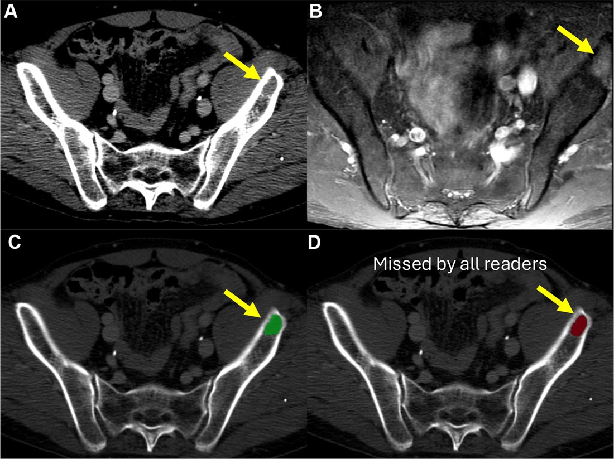

# BoneMet-CT

**Expert-level bone metastasis detection on body CT — trained with MRI + PET/CT reference standards.**

[](https://doi.org/10.1148/ryai.250283)
[](https://zenodo.org/records/14872632)
[](https://doi.org/10.1148/ryai.260247)
[](https://creativecommons.org/licenses/by-nc/4.0/)

Open-source deep learning models from our study in *Radiology: Artificial Intelligence* (RSNA, 2026). They detect bone metastases on routine thoracic and abdominal CT at the level of musculoskeletal radiologists, in **under a minute per scan** — a second-reader "safety net" for the clinical image viewer.

> **Paper** — Lee JO, Kim DH, et al. *Bone Metastasis Detection at CT with Deep Learning Models Trained Using Multicenter, Multimodal Reference Standards: Development and Evaluation.* Radiology: Artificial Intelligence 2026;8(3):e250283. https://doi.org/10.1148/ryai.250283
>
> **Model weights** — https://zenodo.org/records/14872632

<p align="center">
  
</p>

<p align="center"><em>Example case: an indeterminate pelvic metastasis — subtle on CT (A), clear on MRI (B), matching the reference label (C, green) — that Model 2 detected (D, red) but all six radiologist readers missed.</em></p>

---

## Why it matters

Bone is a common metastatic site (especially breast, prostate, and lung cancer), and missed lesions can cause pathologic fracture or spinal cord compression. On a busy oncologic CT read, skeletal metastases are a leading source of false negatives — a detector that flags them could act as a safety net.

Most prior CT detectors are trained **and** graded against labels drawn from CT itself, which ignores the lesions CT cannot show. We asked a harder question: **what if the ground truth comes from MRI and PET/CT, not CT?**

## The core idea: a multimodal reference standard

For each patient we paired the CT with **whole-spine MRI** and **FDG PET/CT** (within 15 days), then labeled each lesion by its CT visibility:

| CT visibility | Definition |
|---|---|
| **Visible** | Clearly identifiable on CT |
| **Indeterminate** | Subtle/equivocal on CT, but confirmed metastatic on MRI or PET |
| **Invisible** | Undetectable on CT, confirmed only on MRI/PET (excluded from training) |

To test how much the label definition matters, we trained two otherwise-identical models:

- **Model 1** — CT-visible lesions only (the conventional approach)
- **Model 2** — visible + indeterminate lesions (the multimodal standard)

## Dataset

- **4 centers** (South Korea), **332 patients**, **502 CT scans**, **4,999 bone metastases**, >12 cancer types (lung + breast ≈ 56%).
- Centers 1–3 → training/validation; **Center 4 → external test** — held out, the only set with cancer-without-metastasis negative controls, ~⅓ of its scans from unseen scanners.
- Annotated by two MSK radiologists by consensus, referencing MRI/PET/CT; substantial agreement on visibility (κ = 0.72).

## Key findings

Performance on the external test set:

| Reader / Model | Lesion precision | Lesion recall | Scan-level AUROC |
|---|---|---|---|
| **Model 2** (visible + indeterminate) | **80.1%** | **41.8%** | **0.80** (0.68–0.90) |
| Model 1 (visible only) | 78.8% | 33.9% | 0.76 (0.64–0.87) |
| Musculoskeletal radiologists (n = 3) | 66.5% | 43.8% | 0.87 (0.80–0.93) |
| Radiologists-in-training (n = 3) | 66.6% | 39.4% | 0.87 (0.80–0.93) |

- **Both models beat radiologists on precision** (≈80% vs ≈66%) — far fewer false alarms.
- **Model 2 matches radiologists on recall and scan-level AUROC**, while **Model 1 falls short**. The only difference is the reference standard: adding MRI/PET-confirmed *indeterminate* lesions to training closed the gap (recall 41.8% vs 33.9%, P < .001).
- Recall looks modest (~42%) **by design** — the MRI/PET bar counts lesions CT can barely show, so even expert radiologists reached only ~44%. A more honest benchmark than CT-defined labels.
- **Generalizes** beyond the contrast-enhanced training data — confirmed on the public noncontrast TCIA Spine-Mets-CT-SEG set.
- **Failure modes** — Model 2's false positives were mostly benign mimics: fractures (40%), bone islands (19%), degenerative change, Schmorl nodes, vertebroplasty.

## Models & usage

Both models are archived on **Zenodo** ([10.5281/zenodo.14872632](https://zenodo.org/records/14872632), CC BY-NC 4.0):

- **Model 2 — nnU-Net Task 503** (visible + indeterminate)
- **Model 1 — nnU-Net Task 504** (visible only)

Inference outline:

1. Install [nnU-Net v1](https://github.com/MIC-DKFZ/nnUNet).
2. Download the weights from Zenodo into your nnU-Net results directory.
3. Predict on axial CT (NIfTI) with the `3d_lowres` configuration (`nnUNet_predict`).
4. Post-process: drop predictions smaller than a 5 mm sphere, then convert masks to bounding boxes.

> See the nnU-Net docs for the exact command. **For research use only; not for clinical use.**

## Editorial commentary

The study is accompanied by an invited commentary in the same issue:

> Khosravi P. *Seeing Beyond CT: Multimodal Data and the Next Frontier of AI for Bone Metastasis Detection.* Radiology: Artificial Intelligence 2026;8(3):e260247. https://doi.org/10.1148/ryai.260247

Khosravi frames the work around a principle at its heart: *"the quality and completeness of the reference standard may be as critical as the sophistication of the model itself."* She highlights the multimodal reference standard as the study's defining contribution, and reads the lower-but-realistic recall as "the intrinsic difficulty of detecting early or subtle metastatic disease at CT," not a model weakness.

As Khosravi concludes, *"future progress may depend as much on how we define and curate the truth within our datasets as on the models we use to learn from them."*

## Citation

If you use these models or build on this work, please cite the paper:

```bibtex
@article{lee2026bonemet,
  title   = {Bone Metastasis Detection at CT with Deep Learning Models Trained
             Using Multicenter, Multimodal Reference Standards: Development and Evaluation},
  author  = {Lee, Jung-Oh and Kim, Dong Hyun and Chae, Hee-Dong and Lee, Eugene
             and Kang, Ji Hee and Lee, Ji Hyun and Kim, Hyo Jin and Seo, Jiwoon
             and Chai, Jee Won},
  journal = {Radiology: Artificial Intelligence},
  volume  = {8},
  number  = {3},
  pages   = {e250283},
  year    = {2026},
  doi     = {10.1148/ryai.250283}
}
```

## License

- **Paper** — © The Author(s) 2026, published by RSNA under CC BY 4.0.
- **Model weights** (Zenodo) — CC BY-NC 4.0 (non-commercial).
